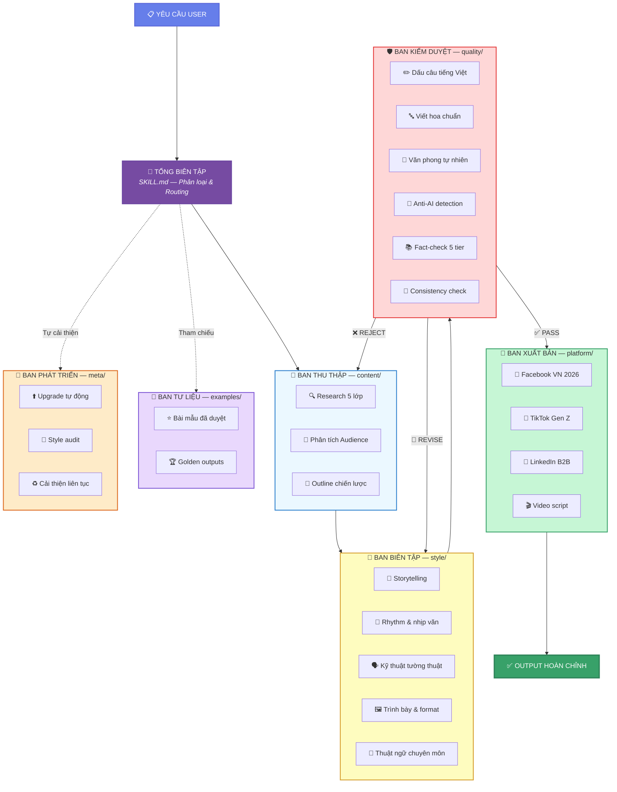
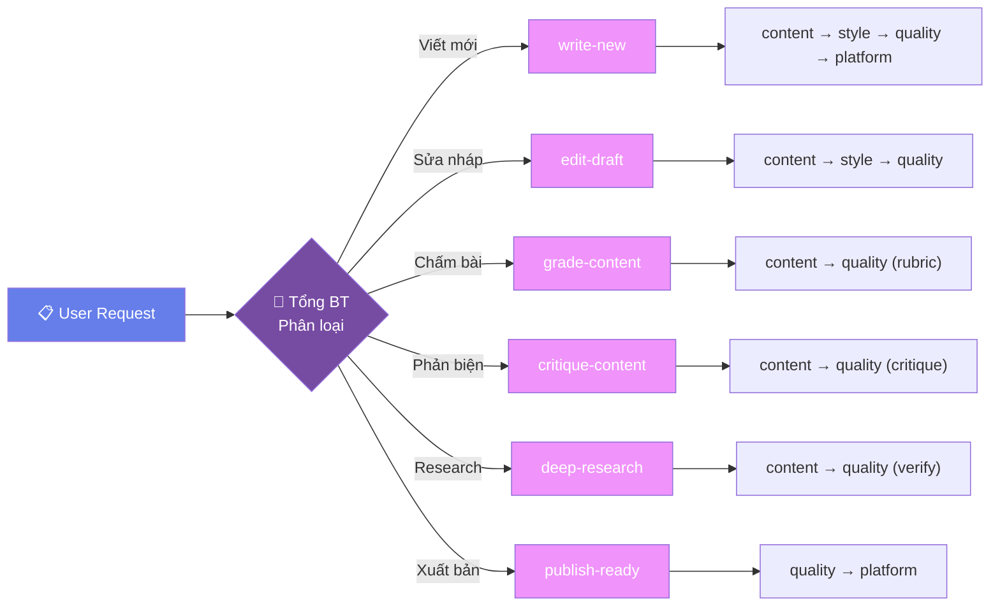
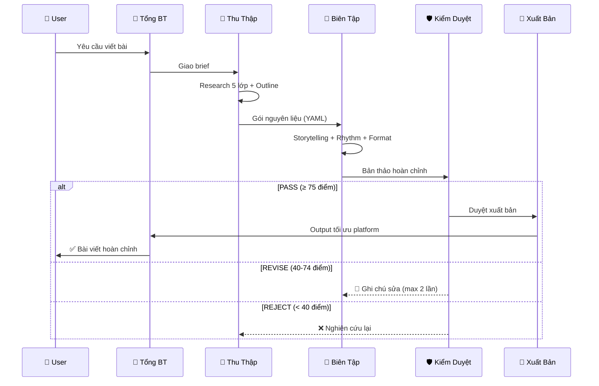

<div align="center">

# ✍️ Viết Chuyên Nghiệp v3.0

### **Kiến Trúc Tòa Soạn — AI Vietnamese Professional Writing System**

*Hệ thống sản xuất nội dung tiếng Việt chuyên nghiệp với AI Tổng Biên Tập*
*điều phối 6 Ban chuyên môn và 25 biên tập viên chuyên biệt*

[](https://github.com/xaotiensinh-abm/viet-chuyen-nghiep)
[](LICENSE)
[](https://ai.google.dev)
[](README.md)
[](Ban/)

<br/>

> **"Viết hay không phải do bẩm sinh — mà do hệ thống."**

<br/>

[Tính năng](#-tính-năng) · [Kiến trúc](#-kiến-trúc-tòa-soạn) · [Bắt đầu](#-bắt-đầu-nhanh) · [Pipelines](#-pipelines) · [Cấu trúc](#-cấu-trúc-dự-án) · [Đóng góp](#-đóng-góp)

---

</div>

## 🌟 Tại sao cần Viết Chuyên Nghiệp?

| Vấn đề thực tế | Giải pháp v3.0 |
|:---|:---|
| 🤖 AI viết ra "mùi máy" — sáo rỗng, rập khuôn | **Anti-AI Engine** phát hiện 15 dấu hiệu AI, tự sửa cho tự nhiên |
| 📝 Viết dài mất cấu trúc, logic rời rạc | **6 Ban chuyên môn** kiểm soát từ research → biên tập → kiểm duyệt |
| 🔄 Repurpose content mất thời gian | **Ban Xuất Bản** tự động tối ưu cho Facebook, TikTok, LinkedIn, Video |
| ❌ Claim sai, thiếu nguồn, mất uy tín | **Ban Kiểm Duyệt** fact-check 5 tầng + consistency check tự động |
| 🇻🇳 Viết hoa, dấu câu tiếng Việt sai | **BTV chuyên biệt** — punctuation, capitalization theo chuẩn chính tả |

---

## ✨ Tính năng

<table>
<tr>
<td width="50%">

### 📚 Viết Long-form
- Ebook nhiều chương
- Tài liệu chuyên môn
- Handbook & hướng dẫn
- Báo cáo nghiên cứu
- Đề án kinh doanh

</td>
<td width="50%">

### 📱 Content Social
- Facebook — storytelling, CTA tối ưu
- TikTok — script viral Gen Z
- LinkedIn — B2B thought leadership
- Video script — short/long form

</td>
</tr>
<tr>
<td>

### 🔍 Đánh giá & Phản biện
- Chấm bài **thang 100 điểm** (6 tiêu chí)
- Phản biện logic & fact-check
- Anti-AI detection & scoring
- Gợi ý cải thiện cụ thể

</td>
<td>

### ✏️ Biên tập & Tối ưu
- Sửa bản nháp cho tự nhiên hơn
- Loại bỏ "mùi dịch" máy
- Nhất quán tone, xưng hô
- Tối ưu SEO & readability

</td>
</tr>
</table>

---

## 🏛️ Kiến trúc Tòa Soạn

Lấy cảm hứng từ mô hình tòa soạn báo chí truyền thống, nơi mỗi bài viết đều phải qua nhiều vòng biên tập trước khi xuất bản.



### 6 Ban — 25 BTV

| Ban | Vai trò | Nhân sự | Files |
|:---|:---|:---:|:---|
| 📰 **Thu Thập** (`content/`) | Research, phân tích, outline | 3 BTV | `lead-content`, `research`, `analysis` |
| 🎨 **Biên Tập** (`style/`) | Phong cách, nhịp văn, kỹ thuật | 6 BTV | `lead-style`, `storytelling`, `rhythm`, `narrative`, `presentation`, `technical` |
| 🛡️ **Kiểm Duyệt** (`quality/`) | Chất lượng, chuẩn chính tả, anti-AI | 7 BTV | `lead-quality`, `punctuation`, `capitalization`, `natural`, `anti-ai`, `fact-check`, `consistency` |
| 📡 **Xuất Bản** (`platform/`) | Tối ưu đa nền tảng | 5 BTV | `lead-platform`, `facebook`, `tiktok`, `linkedin`, `video` |
| 📖 **Tư Liệu** (`examples/`) | Thư viện bài mẫu | 1 Lead | `lead-examples` |
| 🔧 **Phát Triển** (`meta/`) | Tự cải thiện & audit | 3 Agents | `lead-meta`, `upgrade`, `style-audit` |

---

## 🚀 Bắt đầu nhanh

### Yêu cầu

- **AI Agent:** [Antigravity](https://github.com/xaotiensinh-abm) hoặc bất kỳ AI coding agent nào hỗ trợ Skills/SKILL.md
- **Ngôn ngữ:** Tiếng Việt (mặc định), tiếng Anh (khi yêu cầu)

### Cài đặt

```bash
# Clone repository
git clone https://github.com/xaotiensinh-abm/viet-chuyen-nghiep.git

# Hoặc dùng như global skill (Antigravity)
# Tạo junction từ skills/ → workspace/
mklink /J "%USERPROFILE%\.gemini\antigravity\skills\viet-chuyen-nghiep" "path\to\viet-chuyen-nghiep"
```

### Sử dụng

<table>
<tr>
<td width="50%">

**Viết ebook:**
```
/viet-pro
Viết ebook 5 chương về AI cho CEO
```

</td>
<td width="50%">

**Chấm bài:**
```
/viet-pro chấm bài
Chấm bài marketing 800 từ, thang 100
```

</td>
</tr>
<tr>
<td>

**Viết content social:**
```
/viet-pro
Viết 3 bài: FB, TikTok, LinkedIn
về xu hướng remote work 2026
```

</td>
<td>

**Sửa bản nháp:**
```
/viet-pro sửa bài
[Paste bản nháp]
Sửa cho tự nhiên, bớt mùi AI
```

</td>
</tr>
</table>

---

## 🔄 Pipelines

Mỗi loại yêu cầu được xử lý bởi một pipeline chuyên biệt:



### Pipeline chi tiết: `write-new`



---

## 🛡️ Quality Gates

Mỗi bài viết phải vượt qua **6 kiểm tra song song** trước khi xuất bản:

| # | Kiểm tra | BTV | Tiêu chí |
|:---:|:---|:---|:---|
| 1 | **Dấu câu** | `punctuation.md` | 0 lỗi dấu phẩy, chấm, ngoặc |
| 2 | **Viết hoa** | `capitalization.md` | Tên riêng, đầu câu, tổ chức |
| 3 | **Tự nhiên** | `natural.md` | ≤ 2 tín hiệu "mùi dịch" |
| 4 | **Anti-AI** | `anti-ai.md` | Score ≤ 30% (Grade A/B) |
| 5 | **Fact-check** | `fact-check.md` | 100% claims có nguồn tier-1/2 |
| 6 | **Nhất quán** | `consistency.md` | Tone, xưng hô, thuật ngữ đồng bộ |

### Thang Anti-AI

```
🟢 A (≤ 20%)  → PASS — Tự nhiên như người viết
🟡 B (21-40%) → PASS — Khuyến nghị cải thiện
🟠 C (41-60%) → REVISE — Bắt buộc sửa
🔴 D (61-80%) → REJECT — Viết lại
⛔ F (> 80%)  → CRITICAL — Escalate Tổng BT
```

### Rubric 100 điểm

| Tiêu chí | Trọng số | Mô tả |
|:---|:---:|:---|
| Nội dung & độ sâu | **25** | Insight, data, góc nhìn mới |
| Cấu trúc & logic | **20** | Flow, argument, progression |
| Phong cách viết | **20** | Hook, rhythm, voice |
| Chính xác thông tin | **15** | Sources, claims, accuracy |
| Anti-AI score | **10** | Naturalness, human feel |
| Format & trình bày | **10** | Visual hierarchy, readability |

---

## 📁 Cấu trúc dự án

```
viet-chuyen-nghiep/
│
├── 📄 SKILL.md                    ← Entry point — Tổng Biên Tập
├── 📄 README.md                   ← Tài liệu này
├── 📄 CHANGELOG.md                ← Lịch sử phiên bản
├── 📄 HUONG-DAN-SU-DUNG.md        ← Hướng dẫn chi tiết
│
├── 📁 Ban/                        ← 6 Ban chuyên môn (v3.0)
│   ├── content/                   ← 📰 Ban Thu Thập (3 BTV)
│   │   ├── lead-content.md
│   │   ├── research.md
│   │   └── analysis.md
│   ├── style/                     ← 🎨 Ban Biên Tập (6 BTV)
│   │   ├── lead-style.md
│   │   ├── storytelling.md
│   │   ├── rhythm.md
│   │   ├── narrative.md
│   │   ├── presentation.md
│   │   └── technical.md
│   ├── quality/                   ← 🛡️ Ban Kiểm Duyệt (7 BTV)
│   │   ├── lead-quality.md
│   │   ├── punctuation.md
│   │   ├── capitalization.md
│   │   ├── natural.md
│   │   ├── anti-ai.md
│   │   ├── fact-check.md
│   │   └── consistency.md
│   ├── platform/                  ← 📡 Ban Xuất Bản (5 BTV)
│   │   ├── lead-platform.md
│   │   ├── facebook.md
│   │   ├── tiktok.md
│   │   ├── linkedin.md
│   │   └── video.md
│   ├── examples/                  ← 📖 Ban Tư Liệu
│   │   └── lead-examples.md
│   └── meta/                      ← 🔧 Ban Phát Triển (3 agents)
│       ├── lead-meta.md
│       ├── upgrade.md
│       └── style-audit.md
│
├── 📁 Orchestrator/               ← Bộ điều phối
│   ├── editor-in-chief.md         ← Vai trò Tổng BT
│   ├── routing-matrix.md          ← Ma trận định tuyến
│   ├── delegation-protocol.md     ← Quy trình giao thác
│   ├── escalation-rules.md        ← Quy tắc leo thang
│   └── interface-contract.md      ← YAML schema giữa Ban
│
├── 📁 Team-Orchestration/         ← Pipeline definitions
│   ├── write-new.md
│   ├── edit-draft.md
│   ├── grade-content.md
│   ├── critique-content.md
│   ├── deep-research.md
│   ├── publish-ready.md
│   └── golden-test.md             ← Test cases end-to-end
│
├── 📁 Context-Layer/              ← 45+ knowledge files
│   ├── CoreModules/               ← Rubric, anti-AI, source trust
│   ├── Knowledge-Base/            ← Vietnamese writing rules
│   ├── Second-Brain/              ← Accumulated patterns
│   └── Memory/                    ← Session memory
│
├── 📁 Autonomous-Core/            ← 4 engines
│   ├── task-classifier.md
│   ├── workflow-engine.md
│   ├── scoring-engine.md
│   └── state-manager.md
│
└── 📁 docs/                       ← Documentation
    ├── architecture/
    └── business/
```

---

## 🎯 Ví dụ thực tế

### Ví dụ 1: Viết Ebook

```yaml
Input: "Viết ebook 5 chương về AI cho CEO SME Việt Nam"

Pipeline: write-new
  ├─ Ban Thu Thập: Research McKinsey, VCCI, case study VN
  ├─ Ban Biên Tập: Hook storytelling, rhythm biến tấu, giải thích AI dễ hiểu
  ├─ Ban Kiểm Duyệt: Anti-AI ≤ 25%, fact-check 100%, consistency xưng hô "bạn"
  └─ Ban Xuất Bản: Format Markdown → sẵn xuất PDF

Output: Ebook 5 chương, 25,000+ từ, sẵn sàng xuất bản
```

### Ví dụ 2: Content Social Đa Nền Tảng

```yaml
Input: "Viết 3 bài về xu hướng remote work cho FB, TikTok, LinkedIn"

Pipeline: write-new
  ├─ Ban Thu Thập: Data remote work VN/global 2026, 3 angles khác nhau
  ├─ Ban Biên Tập: FB (storytelling) / TikTok (viral hook) / LinkedIn (insight)
  ├─ Ban Kiểm Duyệt: Anti-AI + consistency cross-platform
  └─ Ban Xuất Bản: Tối ưu format, hashtag, CTA cho từng platform

Output: 3 bài ready-to-post, mỗi bài tối ưu riêng cho platform
```

### Ví dụ 3: Chấm Bài Marketing

```yaml
Input: "Chấm bài quảng cáo khóa học online, thang 100"

Pipeline: grade-content
  ├─ Ban Thu Thập: Đọc bài, xác định audience, benchmark
  └─ Ban Kiểm Duyệt: Rubric 100 điểm × 6 tiêu chí

Output:
  ├─ Điểm tổng: 67/100
  ├─ Chi tiết: Nội dung 15/25, Logic 16/20, Style 12/20...
  └─ Đề xuất: "Thêm case study VN, giảm cụm từ AI-generated"
```

---

## 🔧 Tùy chỉnh

### Thêm platform mới

1. Tạo file `Ban/platform/[platform-name].md`
2. Định nghĩa: constraints, format, CTA rules, hashtag strategy
3. Cập nhật `Ban/platform/lead-platform.md` thêm routing

### Thêm BTV chuyên biệt

1. Xác định Ban phù hợp
2. Tạo file `Ban/[ban]/[btv-name].md`
3. Cập nhật Trưởng Ban (`lead-*.md`) thêm delegation

### Tùy chỉnh rubric

Sửa `Context-Layer/CoreModules/rubric-100.md` — thay đổi trọng số hoặc thêm tiêu chí.

---

## 📊 Thống kê hệ thống

<div align="center">

| Metric | Giá trị |
|:---|:---:|
| 📁 Tổng files | **142+** |
| 👥 Agents (BTV) | **25** |
| 🏛️ Ban chuyên môn | **6** |
| 🔄 Pipelines | **6** |
| 📚 Knowledge files | **45+** |
| ⚙️ Engines | **4** |
| 🧪 Audit score | **100/100** |
| 🌐 Platforms | **4** |

</div>

---

## 🗺️ Roadmap

- [ ] 🌏 Thêm platforms: X/Twitter, YouTube, Zalo, Email newsletter
- [ ] 📊 Dashboard analytics: tracking quality metrics over time
- [ ] 🧠 Memory persistence: nhớ style preference qua sessions
- [ ] 📖 Golden examples: thư viện bài mẫu cho mỗi thể loại
- [ ] 🔌 Plugin system: dễ dàng thêm Ban mới
- [ ] 🌍 Multi-language: mở rộng sang tiếng Anh, tiếng Nhật

---

## 🤝 Đóng góp

Chào mừng mọi đóng góp! Đọc hướng dẫn chi tiết tại [HUONG-DAN-SU-DUNG.md](HUONG-DAN-SU-DUNG.md).

### Cách đóng góp

1. **Fork** repository
2. Tạo branch: `git checkout -b feature/ten-tinh-nang`
3. Commit: `git commit -m "Thêm: mô tả tính năng"`
4. Push: `git push origin feature/ten-tinh-nang`
5. Tạo **Pull Request**

### Coding conventions

- Mọi agent file phải có: **Vai trò**, **Input/Output**, **Quy trình**, **Ví dụ**
- Documentation bằng **tiếng Việt** (trừ technical terms)
- YAML cho data structures giữa các Ban

---

## 📜 License

MIT License — Tự do sử dụng, chỉnh sửa, phân phối.

---

<div align="center">

### Được xây dựng với ❤️ bởi

**[ABM — AI Business Mastery](https://github.com/xaotiensinh-abm)**

*Hệ sinh thái AI cho doanh nghiệp Việt Nam*

<br/>

[](https://github.com/xaotiensinh-abm)
[](https://github.com/xaotiensinh-abm)

<br/>

*"Mỗi bài viết đều xứng đáng được biên tập bởi một tòa soạn chuyên nghiệp —*
*giờ đây, tòa soạn đó nằm trong AI của bạn."*

</div>
