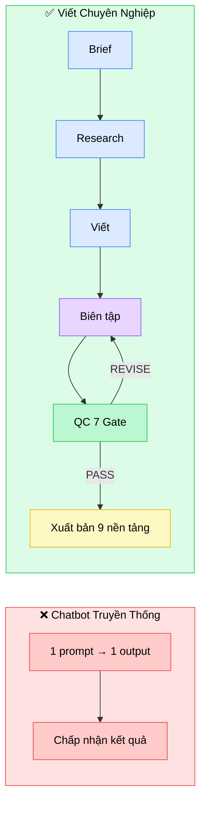
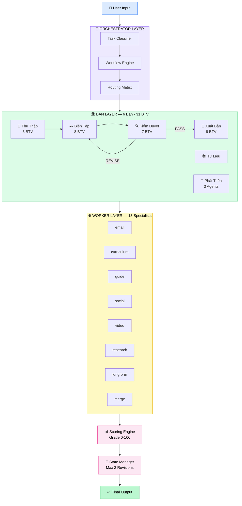
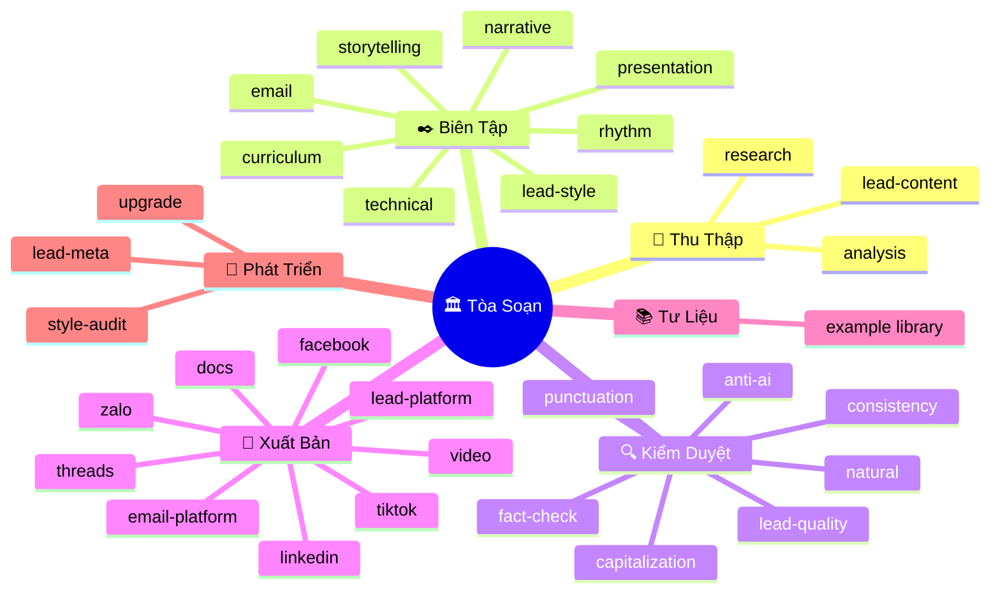
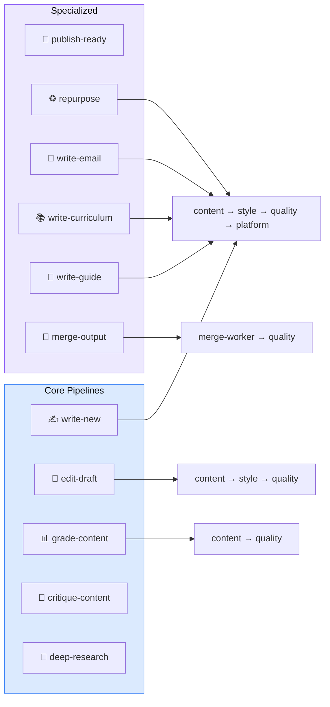
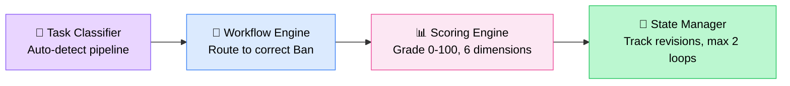
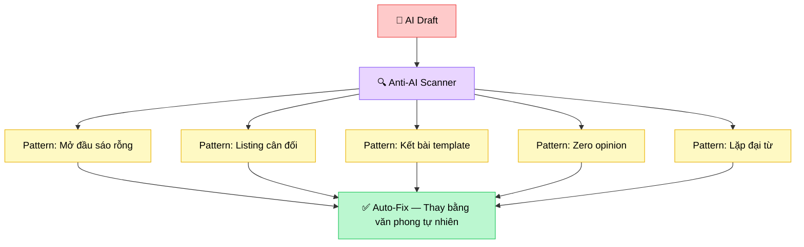
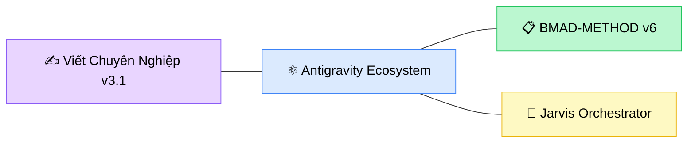

<div align="center">

  

# ✍️ VIẾT CHUYÊN NGHIỆP `v3.1`

### Kiến Trúc Tòa Soạn AI — Vietnamese Professional Writing Engine

> *Không phải chatbot. Đây là một **tòa soạn báo** vận hành bên trong AI.*

**6 Ban** · **31 Biên Tập Viên** · **13 Workers** · **11 Pipelines** · **1 Orchestrator**

[](.)
[](LICENSE)
[](.)
[](.)

</div>

---

## 🧬 Tại sao Tòa Soạn, không phải Chatbot?

> *"Một chatbot viết bài — giống một người làm tất cả. Kết quả? Tạm được.*
> *Nhưng tòa soạn — mỗi người một vai — mới tạo ra xuất sắc."*



| Thế giới thật | Viết Chuyên Nghiệp |
|:---|:---|
| Phóng viên đi thực địa | **Ban Thu Thập** — research trước khi viết |
| Biên tập viên chỉnh sửa | **Ban Biên Tập** — 8 BTV chuyên biệt |
| Tổng biên tập duyệt bài | **Ban Kiểm Duyệt** — 7 gate kiểm tra |
| Trưởng ban phát hành | **Ban Xuất Bản** — tối ưu cho 9 nền tảng |
| Phòng tư liệu | **Ban Tư Liệu** — thư viện bài mẫu |
| Ban phát triển | **Ban Phát Triển** — tự nâng cấp |

---

## ⚡ Quick Start — 30 Giây

```bash
# 🚀 Kích hoạt
/viet-pro

# ✍️ Viết mới
/viet-pro viết ebook "Hướng dẫn AI cho doanh nghiệp Việt Nam"

# 📊 Chấm bài (thang 100 điểm, rubric 6 chiều)
/viet-pro chấm bài article.md

# 🔧 Sửa bản nháp
/viet-pro sửa bài draft.md

# 🎯 Phản biện đa chiều
/viet-pro phản biện report.md

# 📚 Viết giáo trình E-learning
/viet-pro viết giáo trình "Module 3: Prompt Engineering"

# 📧 Viết email
/viet-pro viết email "Cold outreach cho CEO ngành F&B"
```

---

## 🏗️ Kiến Trúc Hệ Thống



---

## 🎯 6 Ban — 31 Biên Tập Viên



<details>
<summary><b>📰 Ban Thu Thập (Content)</b> — 3 BTV</summary>

| BTV | Chức năng |
|:----|:----------|
| `lead-content` | Trưởng ban — Bóc brief, xác định scope |
| `research` | Nghiên cứu sâu, thu thập nguồn |
| `analysis` | Phân tích dữ liệu, tổng hợp insight |

</details>

<details>
<summary><b>✒️ Ban Biên Tập (Style)</b> — 8 BTV</summary>

| BTV | Chức năng |
|:----|:----------|
| `lead-style` | Trưởng ban — Chọn tone, phân bổ BTV |
| `storytelling` | Kể chuyện, narrative arc |
| `rhythm` | Nhịp văn, câu ngắn/dài, tiết tấu |
| `narrative` | Cấu trúc bài viết dạng tường thuật |
| `presentation` | Format slide, bullets, visual hierarchy |
| `technical` | Văn phong kỹ thuật, chuyên ngành |
| `email` | Tone email: formal / casual / sales |
| `curriculum` | Cấu trúc bài giảng, module hóa |

</details>

<details>
<summary><b>🔍 Ban Kiểm Duyệt (Quality)</b> — 7 BTV</summary>

| BTV | Chức năng |
|:----|:----------|
| `lead-quality` | Trưởng ban — Tổng hợp 6 gate, ra quyết định |
| `punctuation` | Dấu câu, chính tả |
| `capitalization` | Viết hoa, viết thường chuẩn Việt |
| `natural` | Văn phong tự nhiên, tránh sáo rỗng |
| `anti-ai` | Phát hiện & loại bỏ dấu vết AI |
| `fact-check` | Kiểm chứng sự kiện, số liệu |
| `consistency` | Nhất quán thuật ngữ xuyên suốt |

**Quyết định:** `PASS` · `REVISE` (max 2 vòng) · `REJECT`

</details>

<details>
<summary><b>📡 Ban Xuất Bản (Platform)</b> — 9 BTV</summary>

| BTV | Nền tảng |
|:----|:---------|
| `lead-platform` | Trưởng ban — Chọn kênh, phân bổ |
| `facebook` | Facebook — hook, engagement, CTA |
| `tiktok` | TikTok — script ngắn, trending |
| `linkedin` | LinkedIn — thought leadership |
| `video` | Kịch bản video dạng dài |
| `email-platform` | Email marketing / B2B / nurture |
| `zalo` | Zalo OA — tone gần gũi, locale VN |
| `threads` | Threads — conversational |
| `docs` | User Guide / SOP / FAQ / Giáo trình |

</details>

<details>
<summary><b>📚 Ban Tư Liệu (Examples)</b></summary>

Thư viện bài mẫu đã qua quality gate — dùng làm reference cho các BTV.

</details>

<details>
<summary><b>🔬 Ban Phát Triển (Meta)</b> — 3 Agents</summary>

| Agent | Chức năng |
|:------|:----------|
| `lead-meta` | Trưởng ban — Điều phối nâng cấp |
| `upgrade` | Phân tích feedback, đề xuất cải tiến |
| `style-audit` | Audit style consistency toàn hệ thống |

</details>

---

## 🔄 11 Pipelines



| Pipeline | Mô tả | Luồng Ban |
|:---------|:-------|:----------|
| `write-new` | Viết mới từ đầu | content → style → quality → platform |
| `edit-draft` | Sửa bản nháp | content → style → quality |
| `grade-content` | Chấm bài thang 100 | content → quality |
| `critique-content` | Phản biện nội dung | content → quality |
| `deep-research` | Nghiên cứu chuyên sâu | content → quality |
| `publish-ready` | Chuẩn bị xuất bản | quality → platform |
| `repurpose` | Tái sử dụng nội dung | content → style → quality → platform |
| `write-email` | Viết email chuyên nghiệp | content → style → quality → platform |
| `write-curriculum` | Viết giáo trình | content → style → quality → platform |
| `write-guide` | Viết guide/SOP/FAQ | content → style → quality → platform |
| `merge-output` | Ghép file, verify encoding | merge-worker → quality |

---

## 🧠 Autonomous Core — 4 Engine



- **Task Classifier** — Tự nhận diện loại task, không cần user chỉ định pipeline
- **Workflow Engine** — Route đúng Ban theo routing matrix
- **Scoring Engine** — Chấm 6 chiều: `Content` · `Structure` · `Style` · `Accuracy` · `Anti-AI` · `Format`
- **State Manager** — Quản lý revision loop (max 2 vòng), escalation rules

---

## 🛡️ Anti-AI Detection Engine

> *Vấn đề lớn nhất của AI writing: đọc là biết AI viết.*



---

## 📂 Cấu Trúc Dự Án

```
viet-chuyen-nghiep/
│
├── 📄 SKILL.md                    # Skill definition (core brain)
├── 📄 viet-pro.md                 # Workflow trigger file
├── 📄 workforce-config.json       # Cấu hình toàn workforce
├── 📄 CHANGELOG.md                # Version history
│
├── 🏛️ Ban/                        # ══ 6 Ban chuyên môn ══
│   ├── content/                   #   📰 Thu Thập (3 BTV)
│   ├── style/                     #   ✒️ Biên Tập (8 BTV)
│   ├── quality/                   #   🔍 Kiểm Duyệt (7 BTV)
│   ├── platform/                  #   📡 Xuất Bản (9 BTV)
│   ├── examples/                  #   📚 Tư Liệu
│   └── meta/                      #   🔬 Phát Triển (3 Agents)
│
├── ⚙️ Workers/                    # 13 Execution Workers
├── 🔄 Team-Orchestration/         # 11 Pipeline definitions
├── 🧠 Autonomous-Core/            # 4 Engine files
├── 📖 Context-Layer/              # Knowledge Base
├── 🎯 Orchestrator/               # Routing matrix
├── 📝 Memory/                     # Session memory
├── 📚 docs/                       # Documentation
├── 🎬 output/                     # Generated content
└── 🔧 scripts/                    # Utility scripts
```

---

## 🎓 Tính Năng Nổi Bật

<table>
<tr>
<td width="50%">

### 🔬 Deep Research First
Mọi bài viết bắt đầu bằng nghiên cứu — không bao giờ viết "từ không khí." Ban Thu Thập research trước, phân tích insight, rồi mới chuyển sang Ban Biên Tập.

</td>
<td width="50%">

### 📊 Chấm Điểm 100
Rubric 6 chiều, trọng số rõ ràng. Không phải "bài này tốt" — mà **"bài này 87/100, mất điểm ở Anti-AI (82) và Structure (85)."**

</td>
</tr>
<tr>
<td width="50%">

### 🔄 Revision Loop
Quality gate → `REVISE` → quay lại Ban Biên Tập → kiểm tra lại. Tối đa 2 vòng. Nếu `REJECT` → escalation lên Orchestrator.

</td>
<td width="50%">

### 📡 Multi-Platform Output
Một nội dung gốc → repurpose cho **9 nền tảng**: Facebook, TikTok, LinkedIn, Video, Email, Zalo, Threads, Docs, Guide.

</td>
</tr>
<tr>
<td width="50%">

### 🧩 Modular & Extensible
Thêm Ban mới? Tạo folder + config. Thêm BTV? Drop file `.md`. Thêm pipeline? Tạo file trong `Team-Orchestration/`.

</td>
<td width="50%">

### 🛡️ Anti-AI Detection
BTV chuyên trách phát hiện & loại bỏ dấu vết AI. Bài viết đầu ra đọc như **con người viết** — không phải máy.

</td>
</tr>
</table>

---

## 📊 Scoring Rubric — 6 Dimensions

| Dimension | Weight | Description |
|:----------|:------:|:------------|
| **Content** | 25% | Depth, originality, value |
| **Structure** | 20% | Logic flow, hierarchy |
| **Style** | 15% | Tone, voice, readability |
| **Accuracy** | 20% | Facts, data, citations |
| **Anti-AI** | 10% | Natural language patterns |
| **Format** | 10% | Layout, visual hierarchy |

---

## 📜 Changelog

Xem chi tiết tại [CHANGELOG.md](CHANGELOG.md).

| Version | Highlights |
|:--------|:-----------|
| **v3.1** | +3 Workers (email/curriculum/guide), +Zalo/Threads BTV, merge-output pipeline |
| **v3.0** | Kiến Trúc Tòa Soạn — 6 Ban, 25→31 BTV, Autonomous Core |
| **v2.0** | Worker-based architecture, SubAgents |
| **v1.0** | Single-agent writing system |

---

## 🤝 Credits & Ecosystem

<div align="center">



Được xây dựng bởi **[ABM](https://github.com/xaotiensinh-abm)** — AI Business Mastery

Powered by **Antigravity** ecosystem · **BMAD-METHOD** v6 · **Jarvis** Multi-Agent Orchestrator

</div>

---

<div align="center">

> *"Viết hay — không phải vì AI giỏi.*
> *Viết hay — vì có tòa soạn giỏi đứng sau AI."*

**Viết Chuyên Nghiệp v3.1** · Made with ❤️ in Vietnam 🇻🇳

</div>
